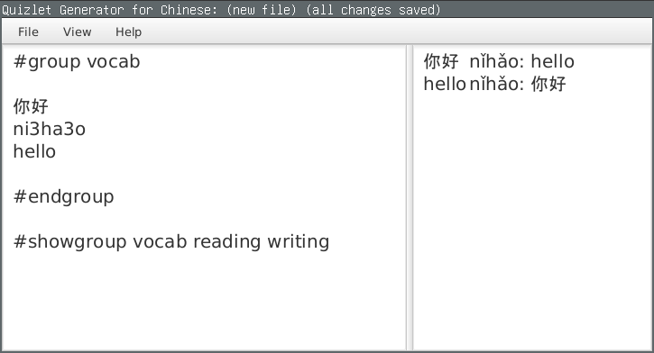

# Quizlet Generator for Chinese

An efficient and powerful way to create Quizlets to study Chinese. Generates flashcard text that can be directly copied into the Quizlet import function.

## Installation

Download the executable JAR file [here](https://github.com/justinyaodu/quizlet-generator-for-chinese/raw/master/jar/quizlet-generator-for-chinese.jar).

## About

This program was written in an afternoon with the original intention of solving the simple problem of making it easier to type pinyin letters with accents. Along the way, it turned into something significantly more advanced, with support for handling user-defined flashcard groups and selecting custom output formats using a basic command language.

## License

This software is licensed under the [MIT License](LICENSE).
